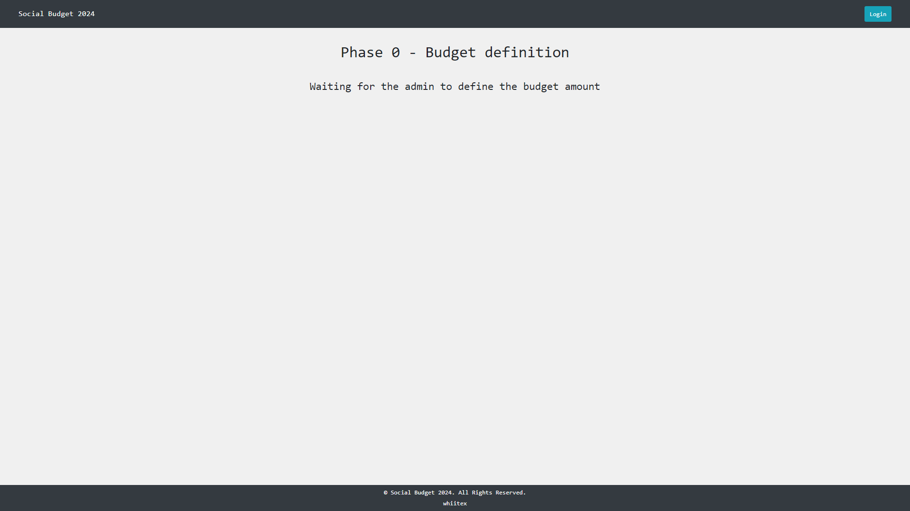
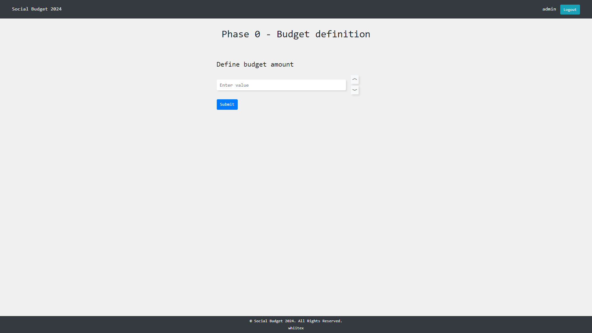
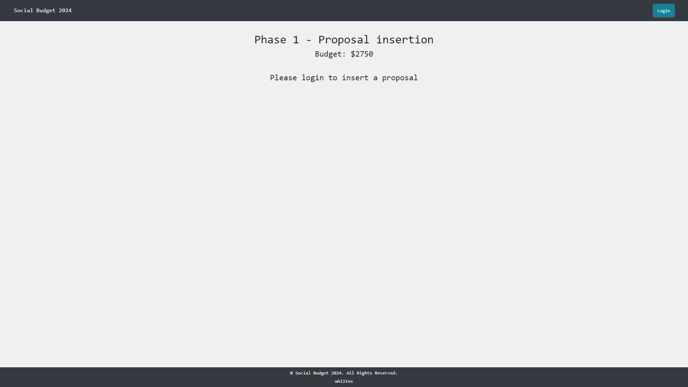
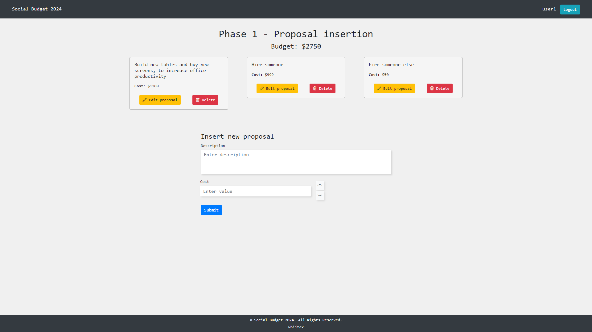
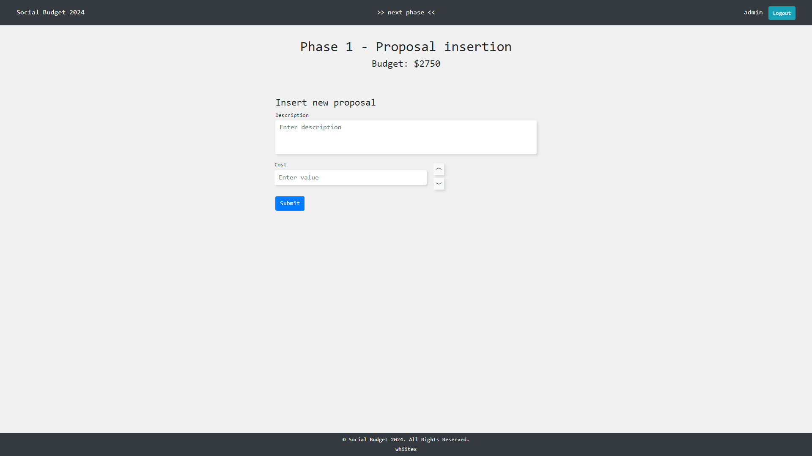
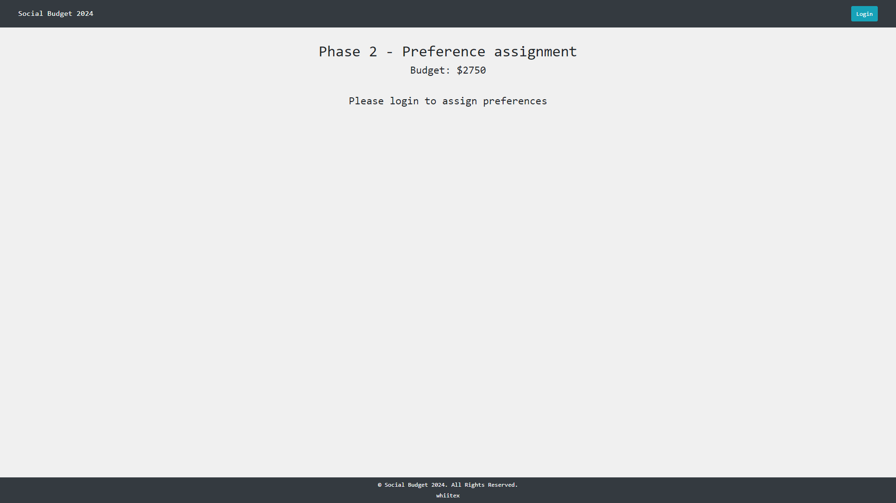
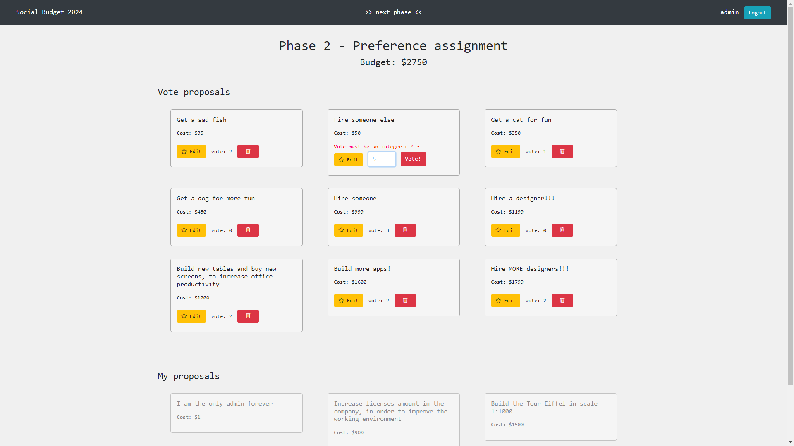
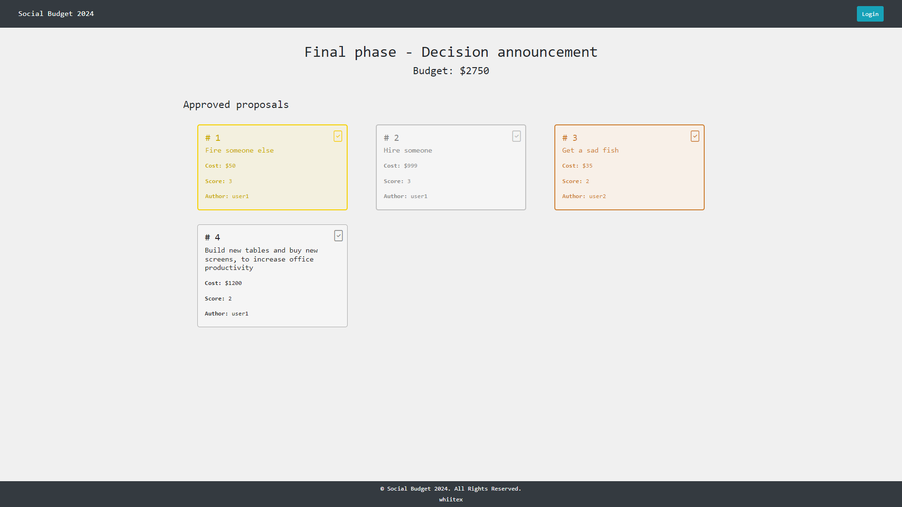
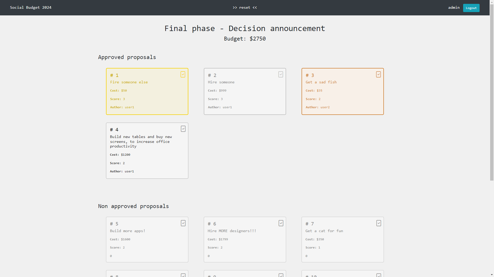

[](https://classroom.github.com/a/CNwikhrY)

# Exam #2: "Social Budget"

## Student: s324466 BIANCO PASQUALE

## React Client Application Routes

- Route `/`: this app is developed as single page, so the only route is the root one

## Main React Components

- `Header` (in [Header/Header.jsx](/client/src/components/Header/Header.jsx)): it is the header of the web page, containing informations as name of the app, name of the user and Login; if the logged user is an admin, a button to manage phases is displayed

- `Login` (in [Auth/Login.jsx](/client/src/components/Auth/Login.jsx)): it contains form to perform authentication by username and password
- `App` (in `App.jsx)

- `Phase0` (in [Phase/Phase0.jsx](/client/src/components/Phase/Phase0.jsx)): this is the body content for first phase, the one used by admin to define the budget and to go to the next phase

- `Phase1` (in [Phase/Phase1.jsx](/client/src/components/Phase/Phase1.jsx)): this is the body content for second phase, that is accessible only by logged users, allowing them to insert their own proposal

  - `Proposal1` (in [Proposal/Proposal1.jsx](/client/src/components/Proposal/Proposal1.jsx)): this is the template for the inserted proposals to be visualized in this phase; it can be removed or modified

- `Phase2` (in [Phase/Phase2.jsx](/client/src/components/Phase/Phase2.jsx)): this is the body content for third phase, that is accessible only by logged users

  - `Proposal2` (in [Proposal/Proposal2.jsx](/client/src/components/Proposal/Proposal2.jsx)): this is the template for the proposal to be visualized in this phase; here the logged user can manage a vote by inserting, deleting or modifying it

- `Phase3` (in [Phase/Phase3.jsx](/client/src/components/Phase/Phase3.jsx)): this is the body content for last phase, in which all users can see final results; moreover, logged user can also see the non approved proposals

  - `Proposal3` (in [Proposal/Proposal3.jsx](/client/src/components/Proposal/Proposal3.jsx)): this is the template for the proposal to be visualized in this phase; it is read-only

- `Footer` (in [Footer/Footer.jsx](/client/src/components/Footer/Footer.jsx)): footer

## API Server

### Authentication

- **POST** `/api/sessions`: login

  - body content:
    ```mjs
    {
      username: "username";
      password: "password";
    }
    ```
  - response body:
    ```mjs
    {
      username: "User username ";
      email: "User email";
      name: "User name";
      surname: "User surname";
      isadmin: true || false;
    }
    ```
  - response status code
    - `200 OK`: user correctly logged in
    - `401 Unauthorized`: wrong credentials
    - `500 Error`: if some error occurs


- **GET** `api/sessions/current`: get user informations

  - body content: _None_
  - response body:
    ```mjs
    {
      username: "User username ";
      email: "User email";
      name: "User name";
      surname: "User surname";
      isadmin: true || false;
    }
    ```
  - response status code
    - `200 OK`: user is logged
    - `401 Unauthorized`: user not logged

- **DELETE** `api/sessions/current`: logout current user
  - body content: _None_
  - response body: _None_
  - response status code:
    - `200 OK`: user is logged
    - `401 Unauthorized`: user not logged
    - `500 Error`: if some error occurs

### Proposals

- **GET** `api/proposals/approved`: returns only approved proposals

  - constraint: _None_
  - body content: _None_
  - response body:
    ```mjs
    [
      {
        id: 'Proposal id'
        author: 'Proposal author'
        description: 'Proposal description'
        cost: 'Proposal cost' // number
        score: 'Proposal final score' // number
        isapproved: true
      }
    ]
    ```
  - response status code:
    - `200 OK`: all good
    - `500 Error`: if some error occurs

- **GET** `api/proposals/`: returns all proposals if phase is 2 or 3, otherwise only logged user authored proposals

  - constraint: logged user
  - body content: _None_
  - response body:
    ```mjs
    [
      {
        id: 'Proposal id'
        author: 'Proposal author' // user.username
        description: 'Proposal description'
        cost: 'Proposal cost' // number
        score: 'Proposal final score' // number
        isapproved: true || false
      }
    ]
    ```
  - response status code:
    - `200 OK`: all good
    - `401 Unauthorized`: user not logged
    - `500 Error`: if some error occurs

- **PUT** `api/proposals/`: insert a new proposal in db

  - constraint: logged user, cost min: 0
  - body content:
    ```mjs
    {
      description: "Proposal description";
      cost: "Proposal cost"; // number
    }
    ```
  - response body:
    ```mjs
    {
      response: true;
    }
    ```
  - response status code:
    - `200 OK`: all good
    - `306`:
      ```mjs
      {
        message: "You have already submitted 3 proposals";
      }
      ```
    - `306`:
      ```mjs
      {
        message: "Not in phase 1";
      }
      ```    - `401 Unauthorized`: user not logged
    - `500 Error`: if some error occurs

- **PUT** `api/proposals/edit`: edit an own proposal in db

  - constraint: logged user, cost min: 0
  - body content:
    ```mjs
    {
      id: "Proposal id";
      description: "Proposal description";
      cost: "Proposal cost"; // number
    }
    ```
  - response body:
    ```mjs
    {
      response: true;
    }
    ```
  - response status code:
    - `200 OK`: all good
    - `401 Unauthorized`: user not logged
    - `306`:
      ```mjs
      {
        message: "User cannot edit another user's proposal";
      }
      ```
    - `306`:
      ```mjs
      {
        message: "Not in phase 1";
      }
      ```
    - `404 Not Found`: if the given id is not found
    - `500 Error`: if some error occurs

- **DELETE** `api/proposals/`: delete a proposal in db

  - constraint: logged user
  - body content:
    ```mjs
    {
      id: "Proposal id";
    }
    ```
  - response body:
    ```mjs
    {
      response: true;
    }
    ```
  - response status code:
    - `200 OK`: all good
    - `306`:
      ```mjs
      {
        message: "Not in phase 1";
      }
      ```
    - `401 Unauthorized`: user not logged
    - `404 Not Found`: if the given id is not found
    - `500 Error`: if some error occurs

- **DELETE** `api/proposals/all`: delete all proposals in db
  - constraint: logged admin
  - body content: _None_
  - response body:
    ```mjs
    {
      response: true;
    }
    ```
  - response status code:
    - `200 OK`: all good
    - `401 Unauthorized`: user not admin
    - `500 Error`: if some error occurs

### Votes

- **GET** `api/votes/`: returns all votes of the logged user

  - constraint: logged user
  - body content: _None_
  - response body:
    ```mjs
    [
      {
        id: 'Vote id'
        proposal_id: 'Proposal id'
        voter: 'User username'
        score: 'Vote score' // number in [0, 3]
      }
    ]
    ```
  - response status code:
    - `200 OK`: all good
    - `401 Unauthorized`: user not logged
    - `500 Error`: if some error occurs

- **POST** `api/votes/`: insert a score in db

  - constraint: logged user
  - body content:

    ```mjs
    {
      proposal: 'Proposal id',
      rating: 'Proposal score' // number in [0, 3]
    }
    ```

  - response body:
    ```mjs
    {
      true;
    }
    ```
  - response status code:
    - `200 OK`: all good
    - `306`:
      ```mjs
      {
        message: "Not in phase 2";
      }
      ```
    - `306`:
      ```mjs
      {
        message: "User cannot vote for his own proposal";
      }
      ```
    - `401 Unauthorized`: user logged
    - `500 Error`: if some error occurs


- **DELETE** `api/votes/`: delete a vote in db

  - constraint: logged user
  - body content:
    ```mjs
    {
      proposal: 'Proposal id',
    }
    ```
  - response body:
    ```mjs
    {
      true;
    }
    ```
  - response status code:
    - `200 OK`: all good
    - `306`:
      ```mjs
      {
        message: "Not in phase 2";
      }
      ```
    - `401 Unauthorized`: user not logged
    - `500 Error`: if some error occurs

### Phase

- **GET** `api/phase/`: get the current phase

  - constraint: _None_
  - body content: _None_
  - response body:
    ```mjs
    {
      id: 'Phase id',
      phase: 'Phase number', // number
      budget: 'Phase budget' // number
    }
    ```
  - response status code:
    - `200 OK`: all good
    - `500 Error`: if some error occurs


- **PUT** `api/phase/`: insert a phase or update it in db, depending on attributes passed; if phase is 3, then it updates proposal according to given budget amount and score ranking 

  - constraint: logged admin
  - body content:
    ```mjs
    {
      phase: 'Phase number', // number
      budget: 'Phase budget' // number
    }
    ```
  - response body:
    ```mjs
    {
      true;
    }
    ```
  - response status code:
    - `200 OK`: all good
    - `401 Unauthorized`: user not admin
    - `500 Error`: if some error occurs


- **DELETE** `api/phase/`: reset db, including votes, proposal and phase tables

  - constraint: logged admin
  - body content: _None_
  - response body:
    ```mjs
    {
      true;
    }
    ```
  - response status code:
    - `200 OK`: all good
    - `401 Unauthorized`: user not admin
    - `500 Error`: if some error occurs


## Database Tables

- Table `users` - contains user data, including hashed password and salt for auth

  - `username`: Text, User username - PRIMARY KEY
  - `email`: Text, User email
  - `name`: Text, User name
  - `surname`: Text, User surname
  - `password`: Text, User password (hashed using crypto.scrypt)
  - `salt`: Text, salt (for authentication)
  - `isadmin`: Boolean, User role

- Table `proposals` - contains all proposals made by logged users

  - `id`: Integer - PRIMARY KEY
  - `author`: Text, Proposal author - FOREIGN KEY (users)
  - `description`: Text - Proposal one line description (max 90 char)
  - `cost`: Integer, Proposal cost
  - `score`: Integer, Proposal final score, computed only at final phase
  - `isapproved`: Boolean, proposal state, computed only at final phase

- Table `votes` - contains all votes, divided by user and proposal

  - `id`: Integer - PRIMARY KEY
  - `proposal_id`: Integer, voted Prosal - FOREIGN KEY (proposals)
  - `voter`: Text, person who voted - FOREIGN KEY (users)
  - `score`: Integer, given vote in [0, 3]

- Table `state` - it will always cotain a single row, that is the current state of the full process

  - `id`: Integer - PRIMARY KEY
  - `phase`: Integer, the current phase
  - `budget`: Decimal, the budget decided by the admin

## Screenshots

### Phase 0

*Phase 0 - unauthenticated and logged users POV (logged users have theis username displayed)*


*Phase 0 - admin POV*

### Phase 1

*Phase 1 - unauthenticated users POV*


*Phase 1 - logged users POV*


*Phase 1 - admin POV (admin can insert proposals too)*

### Phase 2

*Phase 2 - unauthenticated users POV*


*Phase 2 - logged users and admin POV (logged users do not have the "next phase" button)*

### Phase 3

*Phase 3 - unauthenticated users POV*


*Phase 3 - logged users and admin POV (logged users do not have the "reset" button)*
## Users Credentials

| username | password |  role |
| :------- | :------- | ----: |
| admin    | admin    | admin |
| user1    | user1    |  user |
| user2    | user2    |  user |
| user3    | user3    |  user |
